# Module 07

## Exercise: Performance Testing

Screenshot of the performance testings:
1. test_plan_1.jmx
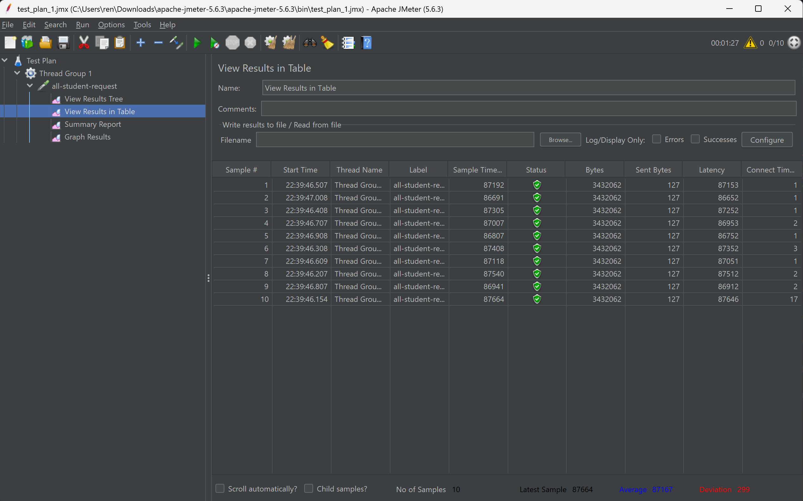
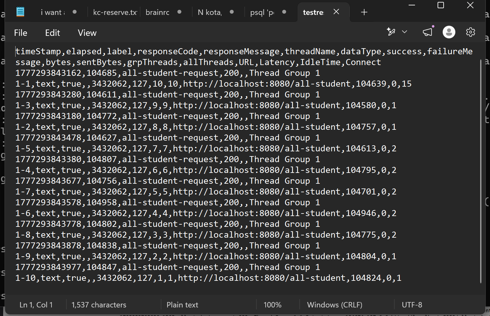

2. test_plan_2.jmx
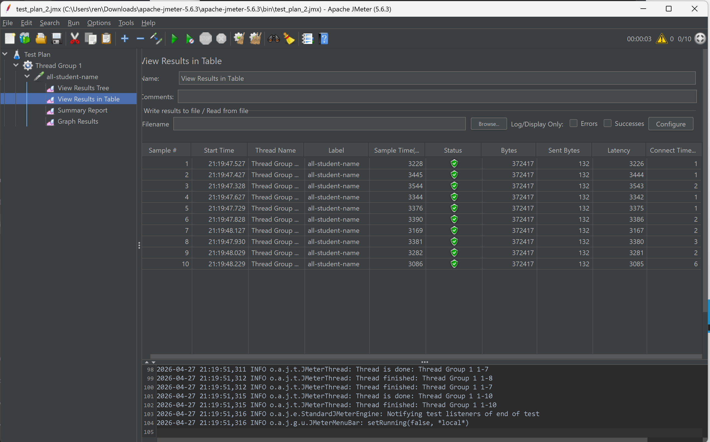
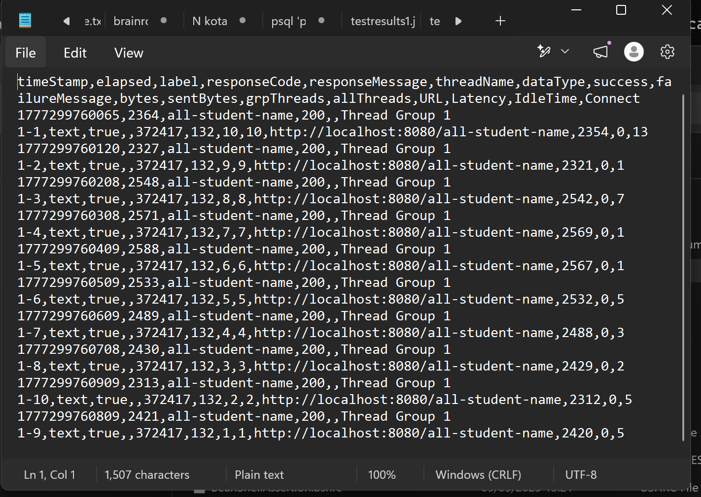

3. test_plan_3.jmx
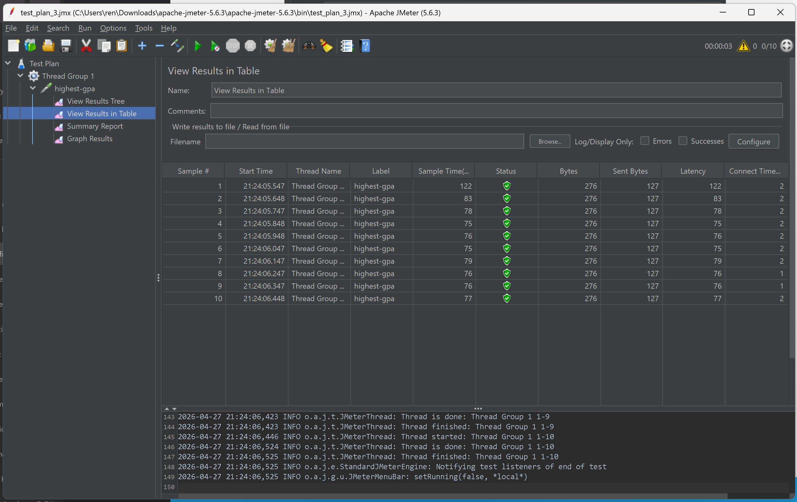
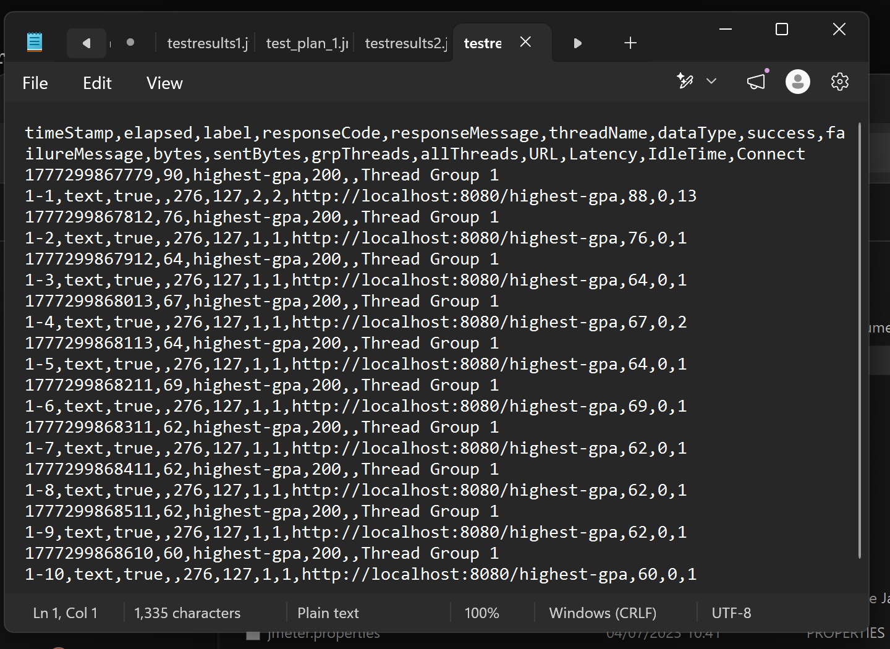

## Exercise: Profiling with IntelliJ IDEA
1. Optimizing method getAllStudentWithCourse
   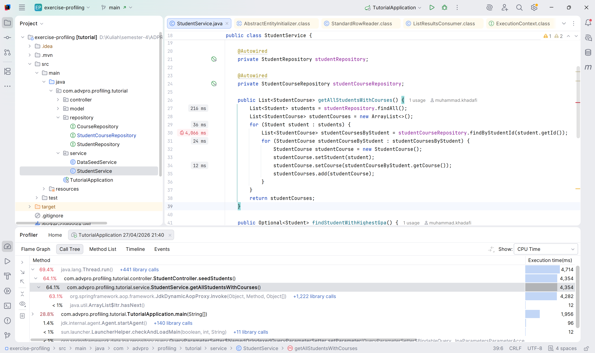
   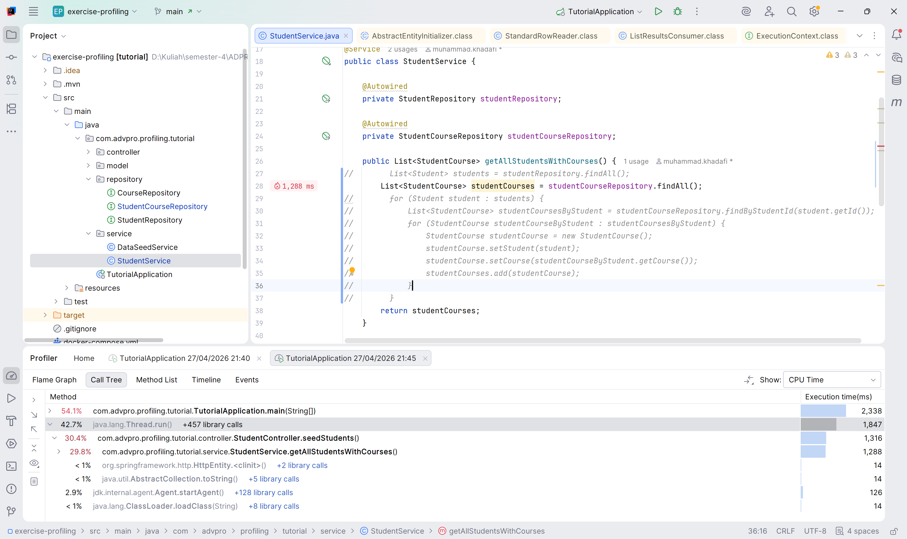
   Berikut hasil JMeter setelah optimisasi:
   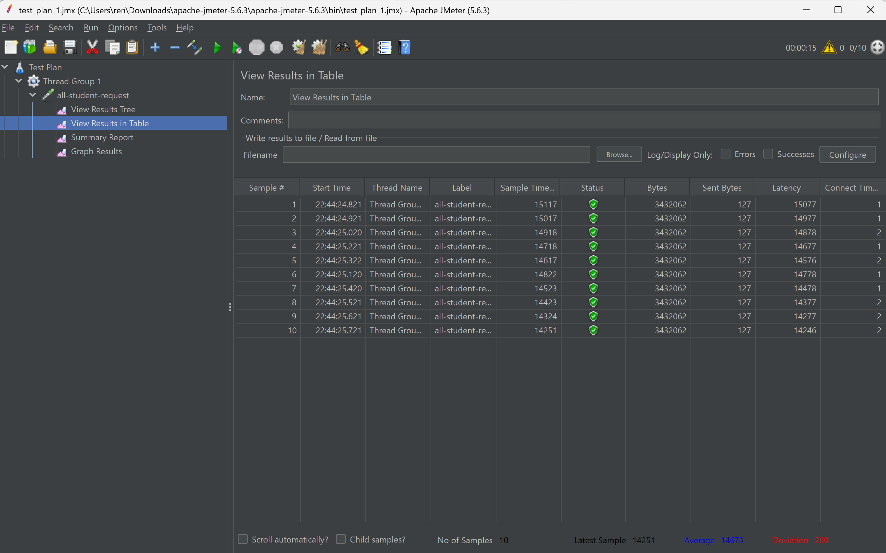
   Dalam Kode sebelumnya, fungsi `getAllStudentWithCourse` memakan waktu sangat banyak (4.4s) sekarang dengan optimisasi sesuai gambar, fungsi tersebut hanya memerlukan 1.8s, performa aplikasi meningkat drastis, lebih dari 50%.

2. Optimizing method joinStudentNames
   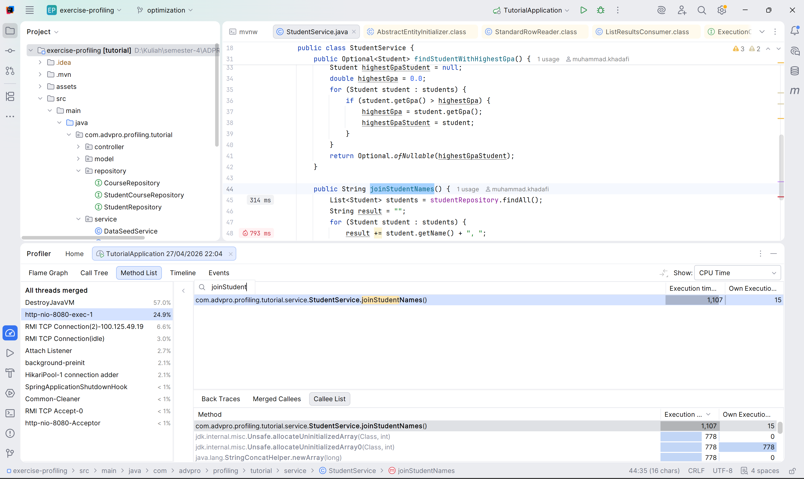
   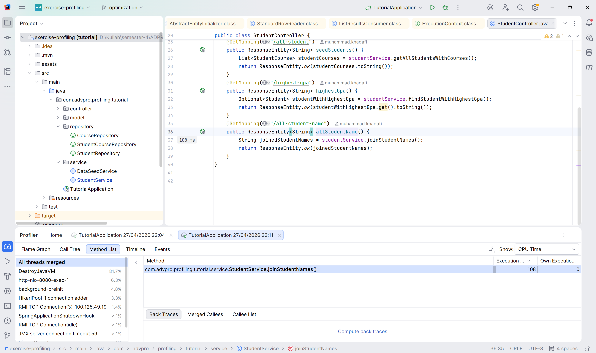
   Berikut hasil JMeter setelah optimisasi:
   
   Dalam Kode sebelumnya, fungsi `joinStudentNames` memakan waktu sangat banyak (~700ms) sekarang dengan optimisasi sesuai gambar, fungsi tersebut hanya memerlukan ~100ms, performa aplikasi meningkat drastis, lebih dari 50%.

3. Optimizing method findStudentWithHighestGpa
   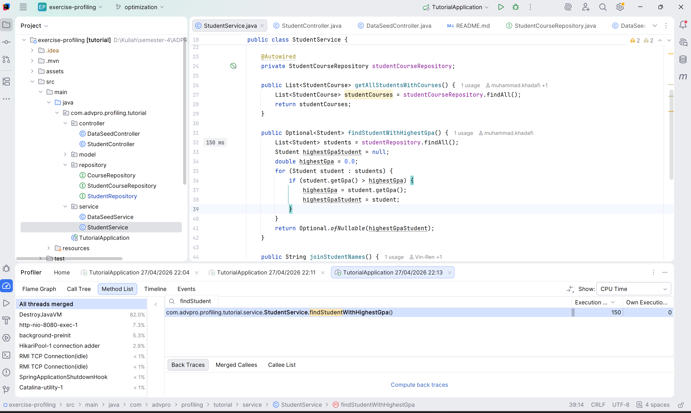
   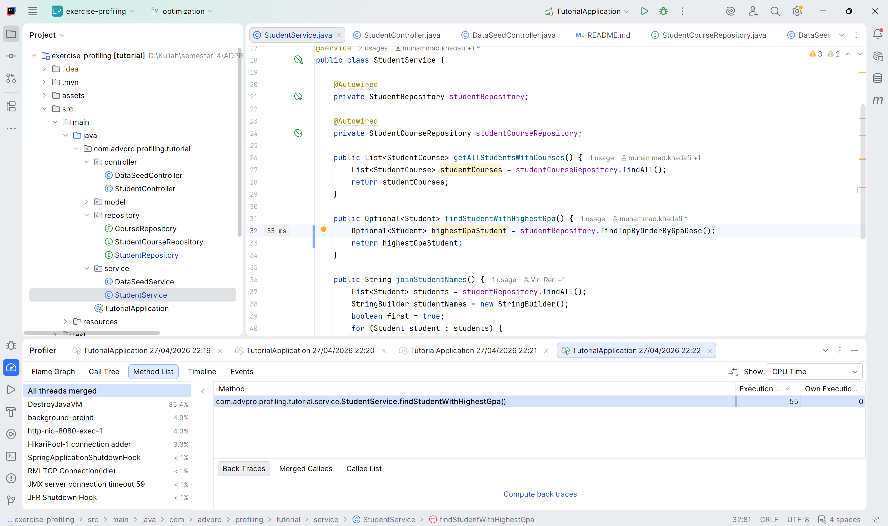
   Berikut hasil JMeter setelah optimisasi:
   
   Dalam Kode sebelumnya, fungsi `findStudentWithHighestGpa` memakan lumayan banyak (~150ms) sekarang dengan optimisasi sesuai gambar, fungsi tersebut hanya memerlukan ~55ms, performa aplikasi meningkat drastis, lebih dari 50%.

**Apakah terdapat perbedaan ketika menjalankan JMeter sebelum dan sesudah optimisasi?**
Ya, terdapat perbedaan dalam performanya, setelah optimisasi, program terasa jauh lebih responsif.

## Reflection
Berikut adalah jawaban untuk pertanyaan-pertanyaan refleksi tersebut:

1. Performance Testing Menggunakan pendekatan black-box atau outside-in. JMeter mensimulasikan ribuan pengguna untuk membanjiri aplikasi dengan request dan mengukur performa dari sudut pandang metrik eksternal, seperti response time, request per second, dan error rate. Tujuannya adalah melihat batas maksimal ketahanan aplikasi saat diberi beban tinggi. 
Sedangkan profiling Menggunakan pendekatan white-box atau inside-out. Profiler berjalan di dalam JVM untuk memantau apa yang terjadi di dalam kode saat aplikasi dieksekusi. Alat ini mengukur metrik internal seperti penggunaan CPU oleh method tertentu, alokasi memori, dan garbage collection. Tujuannya adalah mencari tahu baris kode spesifik mana yang menyebabkan kelambatan.

2. Proses profiling merekam log eksekusi (stack trace) dan penggunaan sumber daya aplikasi. Hasil ini kemudian divisualisasikan dalam bentuk Flame Graph atau Call Tree. Dari visualisasi ini, kita bisa melihat dengan pasti method mana yang memakan waktu eksekusi paling lama (CPU-bound) atau objek mana yang terus-menerus memenuhi heap memory tanpa terhapus (memory leak). Ini menghindarkan kita dari sekadar menebak-nebak (guessing) bagian kode mana yang bermasalah.

3. IntelliJ Profiler sangat efektif untuk menganalisis bottleneck. Keuntungan terbesarnya adalah integrasi langsung dengan IDE. Ketika Anda melihat adanya bottleneck pada flame graph, Anda bisa langsung mengklik visualisasi tersebut untuk melompat ke baris kode sumber yang relevan. 

4. Tantangan yang dihadapi adalah noise dan jumlah data yang masif dari profiler seringkali membuat analisis menjadi membingungkan, selain itu, Overhead dari profiler itu sendiri yang kadang membuat aplikasi berjalan lebih lambat dari biasanya. 
Cara Mengatasinya adalah dengan melakukan performance testing dengan JMeter terlebih dahulu untuk mengisolasi endpoint mana yang bermasalah. Setelah target spesifik ditemukan, jalankan Profiler hanya untuk skenario atau endpoint tersebut. Fokuslah pada method yang berada di bagian paling atas Call Tree dengan persentase execution time terbesar.

5. Manfaat Utama Menggunakan IntelliJ Profiler adalah mendapatkan insight yang sangat mendalam tentang performa aplikasi, bukan hanya dari perspektif eksternal (seperti JMeter) tetapi juga dari dalam kode itu sendiri. 

6. Menangani Inkonsistensi Hasil JMeter dan IntelliJ Profiler
Inkonsistensi sering terjadi karena JMeter mengukur end-to-end latency, sementara Profiler hanya mengukur waktu pemrosesan di dalam aplikasi (JVM). Jika JMeter menunjukkan response time lambat tetapi Profiler menunjukkan eksekusi kode berjalan sangat cepat, masalahnya hampir pasti berada di luar logic aplikasi.
Langkah penanganannya adalah memeriksa infrastruktur eksternal seperti latensi jaringan, query ke database yang mengantri (database locks), proses I/O disk, atau konfigurasi connection pool.

7. Strategi Optimasi setelah bottleneck teridentifikasi bisa meliputi: mengganti struktur data dengan kompleksitas algoritma yang lebih baik (misal O(N) menjadi O(1) menggunakan HashMap), menerapkan caching, meminimalkan pembuatan objek di dalam loop untuk mengurangi beban Garbage Collector, atau menggunakan pendekatan asynchronous/multithreading. 
Kemudian untuk menjaga Fungsionalitas (memastikan perubahan kode tidak merusak fitur yang sudah ada/regression), Anda harus memiliki automated testing yang solid. Menggunakan alur Test-Driven Development (TDD) untuk modul mingguan atau fitur spesifik sangat membantu di sini. Pastikan seluruh Unit Test dan Integration Test berjalan sukses (green) sebelum dan sesudah optimasi. Tes tersebut adalah jaring pengaman utama saat merefaktor kode untuk performa.
